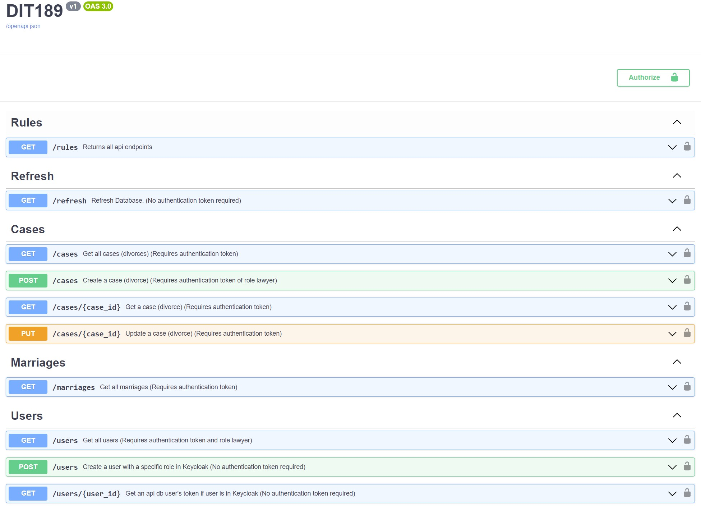

# General

Repo for the project of 2nd semester (2023-2024) course **Web Information Systems and IoT** of the postgraduate program **_Informatics and Telematics_** of **Harokopio University**.

It implements the **consensual divorce** web service as described in [gov.gr](https://dvs.gov.gr/egxeiridio-xrisis).

# Components/Services
- Keycloak IAM for user management
- A Postgres database for Keycloak
- A Flask for backend main app component
- A Postgres database for Flask main app data
- ...

# Tools/Technologies: 
- Microservices: **Docker/Docker Compose, Keycloak, Postgres, ...**
- Backend: **Python, flask/flask-smorest, postgres, sqlalchemy/flask-sqlalchemy, marshmallow, python-keycloak, swagger**
- Frontend: **React, ...**
- Notifications: **...**
- Devops/Deployment: **...**

# Implementation

## Backend Flask app

### Models

Database models were created according to the logic indicated in the below diagram

[Database diagram](https://drawsql.app/teams/akotronis-team/diagrams/dit189-1)

(Folder **models**)

- `user`
- `marriage`
- `user_marriage`
- `divorce`
- `user_divorce`

Implementation with [`flask-sqlalchemy`](https://flask-sqlalchemy.palletsprojects.com/en/3.0.x/)

### Data transfer validation/(de)serialization

Implemented with [`marshmallow`](https://marshmallow.readthedocs.io/en/stable/)

(Folder **schemas**)

- `user`
- `divorce`
- `user_divorce`
- `marriage`
- `refresh` (Repopulates database. For development/presentation puprposes)

### Authentication/Authotization

- User authentication implemented with [Keycloak](https://www.keycloak.org/), along with the python library [python-keycloak](https://pypi.org/project/python-keycloak/)  
- A [decorator is implemented](https://github.com/akotronis/DIT189/blob/main/app/api/keycloak.py#L157) which performs user authentication and authorization based on role using *Header Authorization Bearer token*  
- In order to do authentication/authorization from swwagger interface, click *Authorize* button on the top right and paste the user token  
  This will add the *Authorization Bearer <token>* on each request header,

### Endpoints

(Folder **resources**)

- `user`
- `marriage`
- `divorce`
- `rules`
- `refresh`

#### Users

- `/users` &rarr; **GET**: Return all users in flask app db
- `/users` &rarr; **POST**: Create a user with a specific role in Keycloak
- `/users/<user_id>` &rarr; **GET**: Get an api db user's token if user is in Keycloak

#### Marriages

- `/marriages` &rarr; **GET**: Return all marriages

#### Cases/Divorces

- `/cases` &rarr; **GET**: Return all divorces
- `/cases` &rarr; **POST**: Create a divorce
- `/cases/<case_id>` &rarr; **GET**: Get a divorce
- `/cases/<case_id>` &rarr; **PUT**: Update a divorce

#### Rules

- `/rules` &rarr; **GET**: Return info about all available endpoints/methods.

#### Refresh

- `/refresh` &rarr; **GET**: Repopulates the flask app database with users and marriages (for development/presentation purposes)  
  If `drop` query param is set to `False`, it just returns all the users with their attributes, so we can test use cases.

#### Documentation

Detailed documentation on endpoints and corresponding schemas available on documentation endpoints

- `http://localhost:5000/swagger-ui`, or  
  

- `http://localhost:5000/redoc`

<!--  -->

# Instructions

Make `.env` file as in `.env.example`

`WORK_ENV=prod/dev`. If empty, defaults to `dev`. See `config.py/setup.py` for details.

## Run locally with docker-compose

With Docker (Desktop) installed, on the folder where `docker-compose.yaml` is:

- `>>> docker-compose up`
- In order to work with Keycloak, after the services are up, a realm and two clients (backend and frontend) have to be created in Keycloak and  
  the variables `REAL, CLIENT_ID, CLIENT_SECRET` in `.env` file have to be populated with the corresponding values.  
  After this the services have to be restarted.